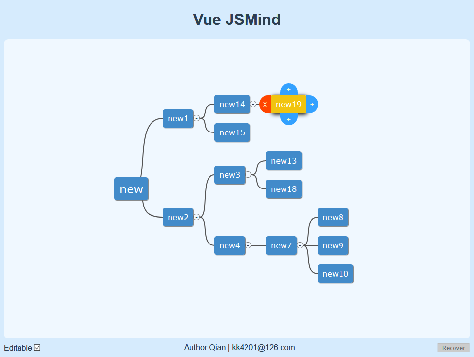

# Vue JsMind

一个网页版的思维导图工具, 基于 Vue 和 Jsmind

## Screenshot

## Start

* ### Project setup
    npm install

* ### Compiles and hot-reloads for development
    npm run serve

* ### Compiles and minifies for production
    npm run build

* ### Lints and fixes files
    npm run lint

## How to use

* select Editable to enable editing
* click node then the controls will pop up
    * 4 control buttons
        * remove node
        * add child node
        * add node before selected
        * add node after selected
* double click node to rename
* drag and drop to move node(s)

## Mainly features

* surround buttons for node control
    * while selected root node, will disable buttons except "add child"
    * self-adaptive position
        * page scroll ✓
        * while renaming ✓
        * after renaming ✓
        * collapse and expand child nodes ✓
        * when selected parent node, right ctrl will obscures the collapse button ×
* draggable  (included from Jsmind)
* adaptive window
* recover deleted node(s)
* import & export mind data
    * private format

### Todo
* import & export mind data
    * other minds' formats
* save mind image
* save data on exit, recover data on start
* show & edit mind data directly, in text area
* show & edit mind meta
* WYSIWYG html node context
* improve performance if needed
    * debounce

## About

A web-based mind tool, based on Vue and Jsmind
